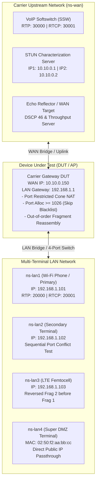

# NAT Lab - Carrier Gateway Conformance Test Suite

An automated, reproducible, evidence-based Network Test Lab for verifying the **Carrier Gateway DUT** against carrier-grade NAT, routing, RTP/RTCP port pairing, latency, fragmentation reassembly, and security requirements.

Built on the Linux Network Test Lab framework using Linux Network Namespaces (`netns`), Linux Bridges, background packet capture (`tcpdump`), and automated wire-level verification (`tshark`).

---

## 1. Network Topology Architecture



---

## 2. Supported Test Scenarios & Requirements Mapping

| Test Phase | Targeted Requirement | Executable Command |
| :--- | :--- | :--- |
| **Phase 1** | Basic IPv4 NAT & NAPT Translation (RFC 3022) | `sudo ./scripts/scenario.sh nat_basic` |
| **Phase 2** | RTCP Port = RTP + 1 Port Pairing (RFC 3550) | `sudo ./scripts/scenario.sh rtcp_port` |
| **Phase 3** | Port-Restricted Cone NAT (RFC 3489 / RFC 4787) | `sudo ./scripts/scenario.sh cone_nat` |
| **Phase 4** | Sequential Port Alloc from 1026 & Blacklist Skipping | `sudo ./scripts/scenario.sh port_alloc` |
| **Phase 5** | Out-of-Order IP Fragmentation Reassembly (Femto VoLTE) | `sudo ./scripts/scenario.sh fragmentation` |
| **Phase 6** | Wired Processing Delay $\le 1\text{ ms}$ on DSCP 46 Packets | `sudo ./scripts/scenario.sh dscp46_latency` |
| **Phase 7** | Super DMZ (TWIN IP) & Static Port Forwarding | `sudo ./scripts/scenario.sh super_dmz` |
| **Phase 8** | Maximum Concurrent Sessions ($\ge 8192$ Conntrack entries) | `sudo ./scripts/scenario.sh concurrency` |
| **Phase 9** | Wire-Rate Throughput ($\ge 1024$B) Unicast + Multicast | `sudo ./scripts/scenario.sh wire_rate` |
| **All** | Complete Regression Test Suite | `sudo ./scripts/scenario.sh all` |

---

## 3. Quick Start Guide

### Step 0: Install System Dependencies (First time only)
```bash
sudo ./scripts/install_deps.sh
```

### Step 1: Pre-Flight Environment Check (Non-root)
```bash
cd /home/dddat/workspace/nat_lab
./scripts/diagnose.sh
```

### Step 2: Initialize Topology (Dual Mode Supported)
```bash
# Mode A: Virtual Simulation Mode (Zero hardware required)
sudo ./scripts/setup.sh --virtual

# Mode B: Physical Dual-USB Hardware Mode (2 USB-to-Ethernet adapters)
# Auto-detects connected USB NICs (USB1 -> DUT WAN port, USB2 -> DUT LAN port):
sudo ./scripts/setup.sh --dual

# Or specify custom USB interfaces explicitly:
sudo ./scripts/setup.sh --physical --wan-if enx6c1ff76608e2 --lan-if enx00e04c88293c
```

### Step 3: Inspect Running State
```bash
./scripts/show_state.sh
```

### Step 4: Run Automated Scenarios
```bash
# Run all test phases end-to-end:
sudo ./scripts/scenario.sh all

# Or run specific test phases:
sudo ./scripts/scenario.sh rtcp_port
sudo ./scripts/scenario.sh cone_nat
sudo ./scripts/scenario.sh port_alloc
sudo ./scripts/scenario.sh fragmentation
sudo ./scripts/scenario.sh dscp46_latency
```

### Step 5: Verify Evidence & Compliance Matrix
```bash
./scripts/verify_compliance.sh
```

### Step 6: Teardown Lab Environment
```bash
# Clean teardown:
sudo ./scripts/cleanup.sh

# Or non-destructive cleanup of artifact files only:
./scripts/cleanup.sh data
```

---

## 4. Test Tools Reference (`tools/`)

- [`tools/rtp_rtcp_test.py`](tools/rtp_rtcp_test.py): Generates RFC 3550 RTP even port $N$ and RTCP odd port $N+1$ streams; validates WAN SSW port pairing.
- [`tools/cone_nat_test.py`](tools/cone_nat_test.py): Implements RFC 3489 / RFC 4787 STUN test suite for Endpoint-Independent Mapping (EIM) and Address & Port-Dependent Filtering (APDF).
- [`tools/sequential_port_test.py`](tools/sequential_port_test.py): Induces port conflicts from multiple LAN clients and validates external port allocation starts $\ge 1026$ and skips all 11 blacklisted ports.
- [`tools/fragmentation_test.py`](tools/fragmentation_test.py): Uses native raw sockets to craft and transmit out-of-order IP fragments (Fragment #2 first, Fragment #1 second) to verify DUT reassembly buffers.
- [`tools/dscp46_latency_test.py`](tools/dscp46_latency_test.py): Measures microsecond-precision latency for packets marked with DSCP 46 (`TOS = 0xB8`).
- [`tools/super_dmz_test.py`](tools/super_dmz_test.py): Injects unsolicited inbound WAN packets to verify Super DMZ / TWIN IP pass-through.
- [`tools/concurrent_sessions_test.py`](tools/concurrent_sessions_test.py): Generates concurrent connection bursts to test conntrack table boundaries.

---

## 5. Documentation
- [Detailed Test Plan & RFC Traceability Matrix](docs/TEST_PLAN.md)
- [Shell Style & Defensive Bash Guidelines](docs/SHELL_STYLE.md)
- [Troubleshooting & Gotchas Runbook](docs/TROUBLESHOOTING.md)
